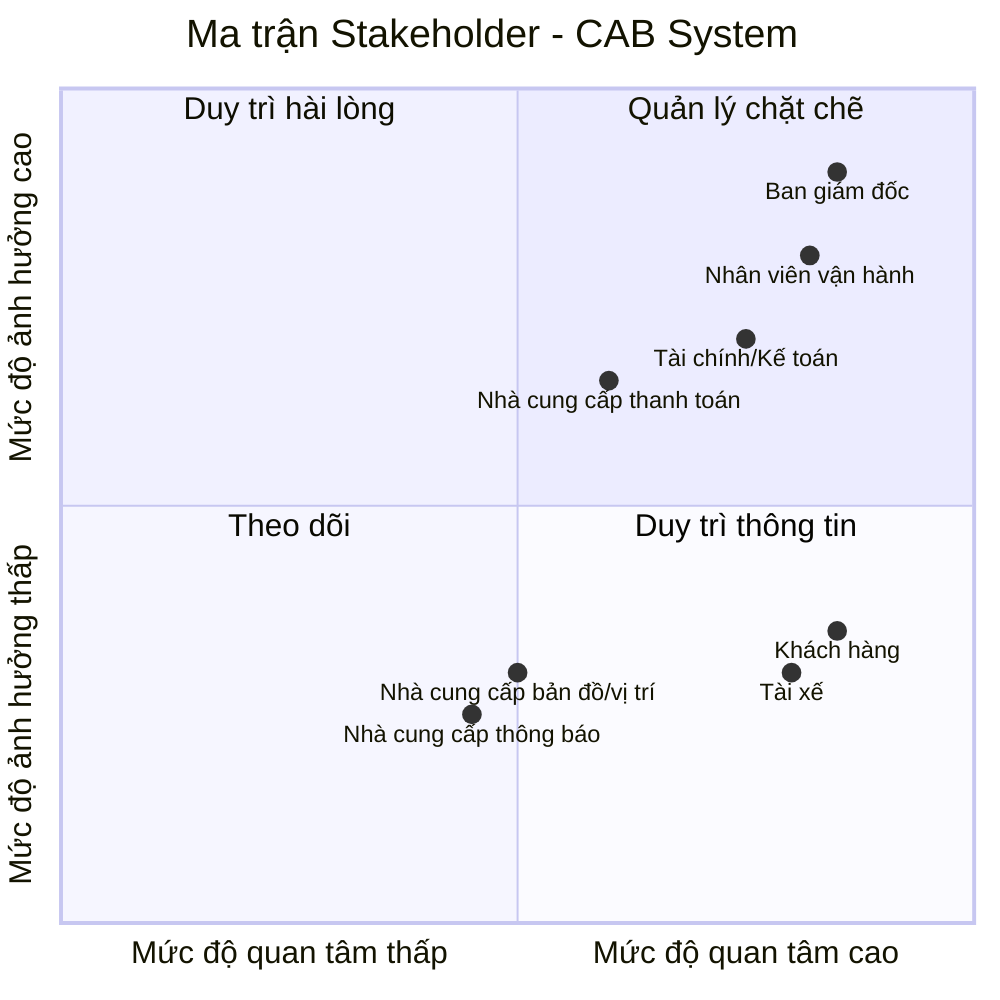

# 23635581_DoanQuocThai_capsystem
hoc thuc hanh buoi 1

## Các yếu điểm và hạn chế của hệ thống hiện tại

| STT | Yếu điểm / hạn chế | Vấn đề cụ thể |
|---|---|---|
| 1 | **Phân công tài xế thủ công** | Việc tìm và phân công tài xế chủ yếu do nhân viên thực hiện, mất thời gian và khó xử lý khi số lượng chuyến tăng. |
| 2 | **Khó theo dõi trạng thái chuyến đi** | Khách hàng khó biết đang tìm tài xế, tài xế nào nhận chuyến, tài xế đã đến chưa hay chuyến đang ở trạng thái nào. |
| 3 | **Thanh toán chưa được quản lý tập trung** | Thông tin thanh toán chưa được quản lý thống nhất, gây khó khăn cho việc tra cứu và quản lý giao dịch. |
| 4 | **Khả năng mở rộng hạn chế** | Hệ thống hiện tại khó đáp ứng khi số lượng khách hàng và tài xế tăng lên. |
| 5 | **Phụ thuộc vào tổng đài / ứng dụng đơn giản** | Khách hàng chỉ có thể liên hệ tổng đài hoặc sử dụng ứng dụng đơn giản, chưa có nền tảng đặt xe đầy đủ. |
| 6 | **Xử lý tìm tài xế chưa tự động** | Khi tài xế được đề xuất không phản hồi hoặc từ chối, hệ thống hiện tại chưa có cơ chế tự động tìm tài xế khác được mô tả. |
| 7 | **Thiếu khả năng theo dõi vị trí tài xế** | Chưa có cơ chế quản lý vị trí tài xế để hỗ trợ tìm tài xế gần khách hàng và dự kiến thời gian đến. |
| 8 | **Khó quản lý hoạt động vận hành** | Bộ phận vận hành gặp khó khăn trong việc theo dõi chuyến đi và quản lý hoạt động khi quy mô hệ thống tăng. |
| 9 | **Khả năng phát triển tính năng mới hạn chế** | Hệ thống hiện tại chưa đáp ứng tốt yêu cầu phát triển thêm các loại dịch vụ, phương thức thanh toán hoặc kênh thông báo trong tương lai. |       

## Tại sao cần một hệ thống mới?

Hệ thống mới được xây dựng nhằm khắc phục những hạn chế của hệ thống hiện tại và đáp ứng nhu cầu phát triển của doanh nghiệp.

1. **Tự động hóa việc tìm và phân công tài xế:** Giảm sự phụ thuộc vào nhân viên vận hành và rút ngắn thời gian tìm tài xế.

2. **Cải thiện trải nghiệm khách hàng:** Cho phép khách hàng đặt xe, theo dõi trạng thái chuyến đi và biết thông tin tài xế theo thời gian thực.

3. **Quản lý thanh toán tập trung:** Quản lý thông tin và kết quả giao dịch một cách thống nhất, hỗ trợ cả tiền mặt và thanh toán điện tử.

4. **Nâng cao hiệu quả vận hành:** Nhân viên có thể quản lý khách hàng, tài xế, phương tiện và chuyến đi trên một hệ thống.

5. **Hỗ trợ mở rộng hệ thống:** Có kiến trúc linh hoạt, cho phép hệ thống phục vụ nhiều khách hàng và tài xế hơn khi nhu cầu tăng.

6. **Dễ dàng phát triển trong tương lai:** Có thể bổ sung loại dịch vụ, phương thức thanh toán và kênh thông báo mới mà không phải xây dựng lại toàn bộ hệ thống.
### Mục tiêu của hệ thống mới

> Xây dựng một nền tảng CAB hiện đại, tự động và có khả năng mở rộng, hỗ trợ toàn bộ quy trình từ **đặt xe → tìm tài xế → thực hiện chuyến → tính cước → thanh toán → đánh giá**.

## Stakeholder chính
   
| # | Stakeholder | Vai trò | Tầm quan trọng |
|---|---|---|---|
| 1 | **Khách hàng (Customer)** | Đặt xe, theo dõi chuyến đi, thanh toán và đánh giá tài xế. | **Rất quan trọng** – Là người sử dụng trực tiếp hệ thống và tạo ra các yêu cầu đặt xe. |
| 2 | **Tài xế (Driver)** | Nhận chuyến, thực hiện chuyến và cập nhật trạng thái. | **Rất quan trọng** – Là bên trực tiếp cung cấp dịch vụ và quyết định khả năng thực hiện chuyến. |
| 3 | **Nhân viên vận hành (Operation Staff)** | Quản lý khách hàng, tài xế, phương tiện và chuyến đi. | **Rất quan trọng** – Đảm bảo hoạt động vận hành được quản lý và xử lý sự cố kịp thời. |
| 4 | **Bộ phận Tài chính (Finance/Accounting)** | Theo dõi thanh toán, giao dịch và doanh thu. | **Quan trọng** – Đảm bảo các giao dịch, doanh thu và đối soát được quản lý chính xác. |
| 5 | **Ban giám đốc (Management)** | Theo dõi báo cáo và đưa ra quyết định kinh doanh. | **Quan trọng** – Xác định mục tiêu kinh doanh và đánh giá hiệu quả của hệ thống. |
| 6 | **Nhà cung cấp thanh toán (Payment Provider)** | Xử lý các giao dịch thanh toán điện tử. | **Quan trọng** – Đảm bảo thanh toán điện tử được thực hiện an toàn và chính xác. |
| 7 | **Nhà cung cấp thông báo (Notification Provider)** | Gửi thông báo đến khách hàng và tài xế. | **Quan trọng** – Đảm bảo thông tin về chuyến đi và thanh toán được truyền đến người dùng. |
| 8 | **Nhà cung cấp bản đồ/vị trí (Map & Location Provider)** | Cung cấp dữ liệu vị trí và hỗ trợ tìm tài xế. | **Quan trọng** – Hỗ trợ xác định vị trí và tìm tài xế phù hợp với khách hàng. |

## Ma trận Stakeholder – CAB System

# Phạm vi cốt lõi trong 7 tuần

| Vấn đề cốt lõi | Nội dung cần giải quyết |
|---|---|
| **Đặt xe** | Khách hàng nhập điểm đón, điểm đến, chọn loại xe và gửi yêu cầu. |
| **Tìm tài xế** | Hệ thống tự động tìm tài xế phù hợp và xử lý khi tài xế từ chối hoặc không phản hồi. |
| **Thực hiện chuyến** | Tài xế nhận chuyến và cập nhật trạng thái đến khi hoàn thành. |
| **Theo dõi chuyến** | Khách hàng theo dõi trạng thái chuyến và thông tin tài xế. |
| **Tính cước & thanh toán** | Tính số tiền phải trả, hỗ trợ tiền mặt và thanh toán điện tử. |
| **Thông báo** | Thông báo các sự kiện quan trọng cho khách hàng và tài xế. |
| **Quản lý vận hành** | Nhân viên quản lý khách hàng, tài xế, phương tiện và chuyến đi. |
| **Bảo mật & dữ liệu** | Xác thực, phân quyền và bảo vệ thông tin cá nhân, vị trí, giao dịch. |

# Business Goals

| ID | Business Goal |
|---|---|
| **BG-01** | Cung cấp quy trình đặt xe nhanh chóng và thuận tiện cho khách hàng. |
| **BG-02** | Tự động hóa quá trình tìm và phân công tài xế, giảm sự phụ thuộc vào nhân viên vận hành. |
| **BG-03** | Đảm bảo chuyến xe được thực hiện và quản lý đầy đủ từ khi tài xế nhận chuyến đến khi hoàn thành. |
| **BG-04** | Cải thiện khả năng theo dõi chuyến và trải nghiệm của khách hàng. |
| **BG-05** | Quản lý việc tính cước và thanh toán chính xác, an toàn và thuận tiện. |
| **BG-06** | Đảm bảo khách hàng và tài xế nhận được thông tin kịp thời về chuyến đi và thanh toán. |
| **BG-07** | Nâng cao hiệu quả quản lý và giám sát hoạt động vận hành của doanh nghiệp. |
| **BG-08** | Đảm bảo hệ thống hoạt động an toàn và bảo vệ dữ liệu của người dùng và doanh nghiệp. |

# Business Requirements

| ID | Business Requirement | Business Goal |
|---|---|---|
| **BR-01** | Hệ thống phải hỗ trợ khách hàng tạo yêu cầu đặt xe dựa trên điểm đón, điểm đến và loại xe. | BG-01 |
| **BR-02** | Hệ thống phải tự động tìm và phân công tài xế phù hợp với yêu cầu đặt xe. | BG-02 |
| **BR-03** | Hệ thống phải hỗ trợ quản lý toàn bộ quá trình thực hiện chuyến xe. | BG-03 |
| **BR-04** | Hệ thống phải cung cấp thông tin trạng thái chuyến và tài xế cho khách hàng. | BG-04 |
| **BR-05** | Hệ thống phải tính số tiền khách hàng phải trả và hỗ trợ các phương thức thanh toán được doanh nghiệp chấp nhận. | BG-05 |
| **BR-06** | Hệ thống phải gửi thông báo cho khách hàng và tài xế về các sự kiện quan trọng. | BG-06 |
| **BR-07** | Hệ thống phải cung cấp công cụ để nhân viên vận hành quản lý khách hàng, tài xế, phương tiện và chuyến đi. | BG-07 |
| **BR-08** | Hệ thống phải xác thực người dùng, kiểm soát quyền truy cập và bảo vệ dữ liệu quan trọng. | BG-08 |

# Functional Requirements

| Business Requirement | Functional Requirements |
|---|---|
| **BR-01: Đặt xe** | • **FR-01.1:** Cho phép khách hàng nhập điểm đón và điểm đến. • **FR-01.2:** Cho phép khách hàng chọn loại xe và gửi yêu cầu đặt xe. • **FR-01.3:** Ghi nhận yêu cầu và tạo chuyến đi. |
| **BR-02: Tìm tài xế** | • **FR-02.1:** Xác định tài xế đang sẵn sàng và phù hợp. • **FR-02.2:** Ưu tiên tài xế dựa trên vị trí và tiêu chí vận hành. • **FR-02.3:** Gửi yêu cầu chuyến và ghi nhận phản hồi của tài xế. • **FR-02.4:** Tiếp tục tìm tài xế khác khi tài xế từ chối hoặc không phản hồi. • **FR-02.5:** Thông báo cho khách hàng khi không tìm được tài xế. |
| **BR-03: Thực hiện chuyến** | • **FR-03.1:** Cho phép tài xế nhận chuyến. • **FR-03.2:** Hệ thống cho phép tài xế cập nhật các trạng thái chính của chuyến từ khi đến điểm đón đến khi hoàn thành. • **FR-03.3:** Ghi nhận và lưu trạng thái hoàn thành chuyến. |
| **BR-04: Theo dõi chuyến** | • **FR-04.1:** Hiển thị trạng thái hiện tại của chuyến cho khách hàng. • **FR-04.2:** Hiển thị thông tin tài xế và phương tiện. • **FR-04.3:** Hệ thống cập nhật trạng thái chuyến cho khách hàng khi có thay đổi. |
| **BR-05: Tính cước & thanh toán** | • **FR-05.1:** Tính số tiền khách hàng phải trả sau khi chuyến hoàn thành. • **FR-05.2:** Hỗ trợ thanh toán bằng tiền mặt và thanh toán điện tử. • **FR-05.3:** Ghi nhận trạng thái và kết quả giao dịch. • **FR-05.4:** Thông báo kết quả thanh toán cho khách hàng. |
| **BR-06: Thông báo** | • **FR-06.1:** Gửi thông báo khi yêu cầu đặt xe được tiếp nhận. • **FR-06.2:** Gửi thông báo khi tài xế nhận chuyến và khi trạng thái chuyến thay đổi. • **FR-06.3:** Gửi thông báo về kết quả thanh toán. • **FR-06.4:** Gửi thông báo cho tài xế về chuyến mới hoặc thay đổi liên quan đến chuyến. |
| **BR-07: Quản lý vận hành** | • **FR-07.1:** Cho phép nhân viên quản lý khách hàng, tài xế và phương tiện. • **FR-07.2:** Cho phép nhân viên theo dõi chuyến đang diễn ra và trạng thái tài xế. • **FR-07.3:** Cho phép nhân viên tra cứu lịch sử chuyến và giao dịch. • **FR-07.4:** Hỗ trợ nhân viên xử lý các trường hợp chuyến bị lỗi. |
| **BR-08: Bảo mật & dữ liệu** | • **FR-08.1:** Yêu cầu xác thực người dùng trước khi sử dụng chức năng yêu cầu tài khoản. • **FR-08.2:** Phân quyền người dùng theo vai trò. • **FR-08.3:** Bảo vệ thông tin cá nhân, dữ liệu vị trí và dữ liệu giao dịch. • **FR-08.4:** Lưu vết các thao tác quản trị quan trọng. |
