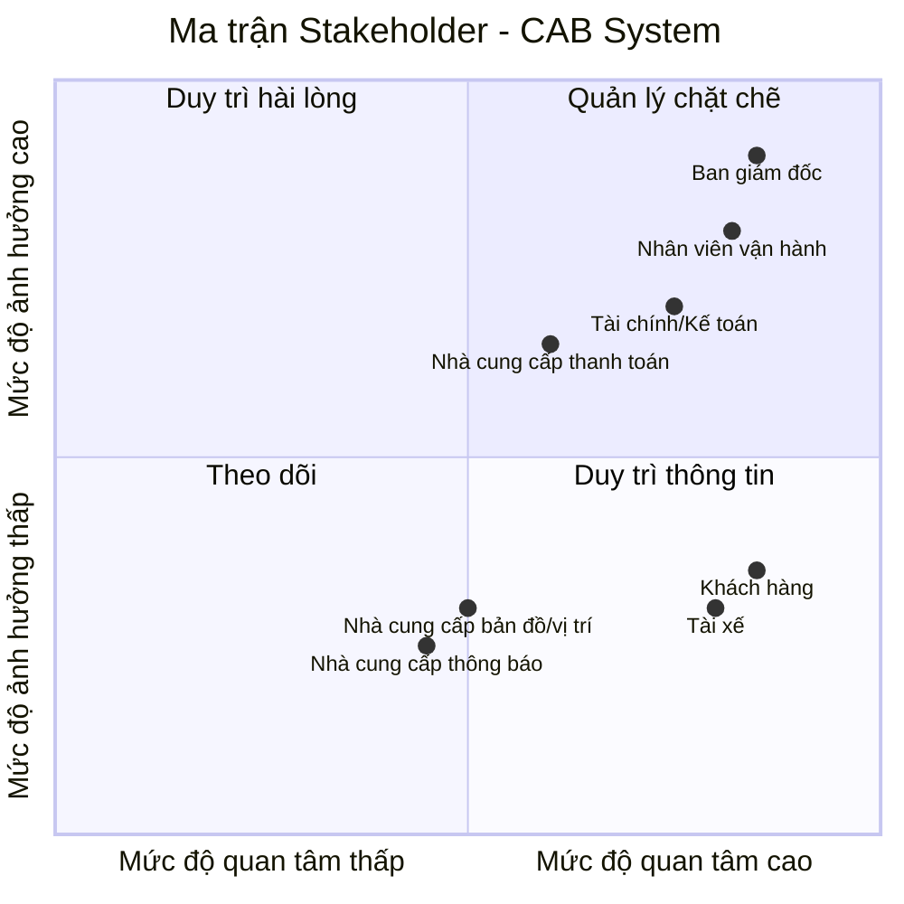
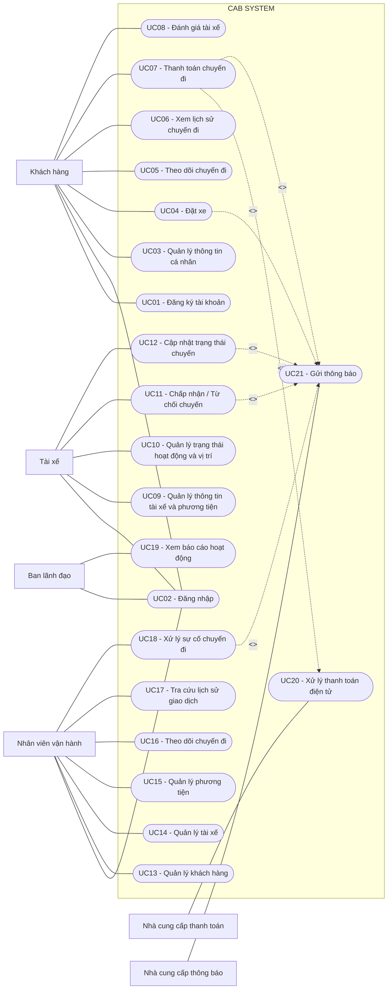
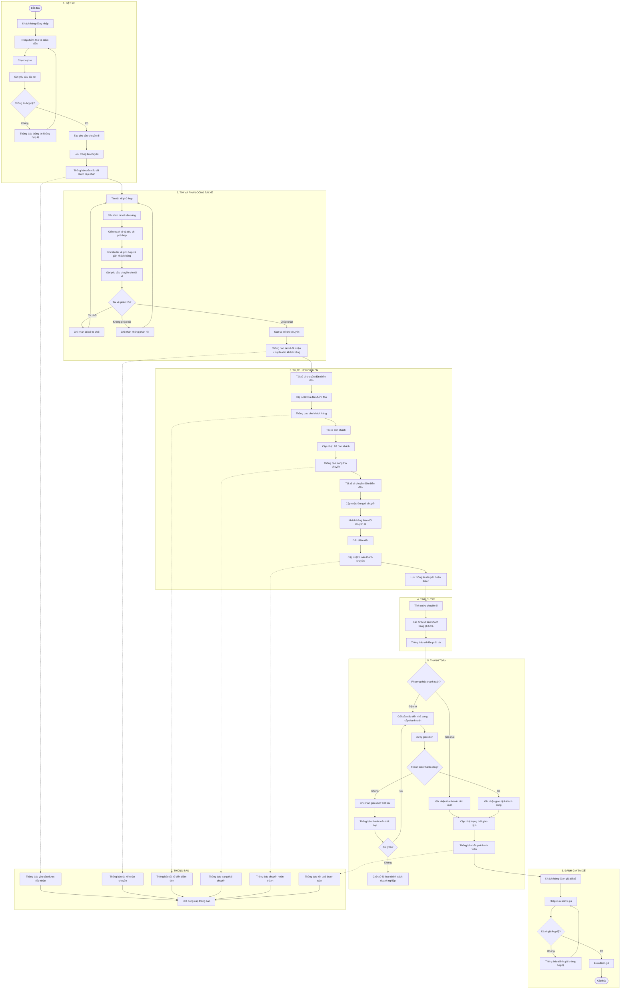

**Dự án xây dựng hệ thống CAB System – Nền tảng đặt xe**
## Các yếu điểm và hạn chế của hệ thống hiện tại

| STT | Yếu điểm / hạn chế | Vấn đề cụ thể |
|---|---|---|
| 1 | **Phân công tài xế thủ công** | Việc tìm và phân công tài xế chủ yếu do nhân viên thực hiện, mất thời gian và khó xử lý khi số lượng chuyến tăng. |
| 2 | **Khó theo dõi trạng thái chuyến đi** | Khách hàng khó biết đang tìm tài xế, tài xế nào nhận chuyến, tài xế đã đến chưa hay chuyến đang ở trạng thái nào. |
| 3 | **Thanh toán chưa được quản lý tập trung** | Thông tin thanh toán chưa được quản lý thống nhất, gây khó khăn cho việc tra cứu và quản lý giao dịch. |
| 4 | **Khả năng mở rộng hạn chế** | Hệ thống hiện tại khó đáp ứng khi số lượng khách hàng và tài xế tăng lên. |
| 5 | **Phụ thuộc vào tổng đài / ứng dụng đơn giản** | Khách hàng chỉ có thể liên hệ tổng đài hoặc sử dụng ứng dụng đơn giản, chưa có nền tảng đặt xe đầy đủ. |
| 6 | **Xử lý tìm tài xế chưa tự động** | Khi tài xế được đề xuất không phản hồi hoặc từ chối, hệ thống hiện tại chưa có cơ chế tự động tìm tài xế khác được mô tả. |
| 7 | **Thiếu khả năng theo dõi vị trí tài xế** | Chưa có cơ chế quản lý vị trí tài xế để hỗ trợ tìm tài xế gần khách hàng và dự kiến thời gian đến. |
| 8 | **Khó quản lý hoạt động vận hành** | Bộ phận vận hành gặp khó khăn trong việc theo dõi chuyến đi và quản lý hoạt động khi quy mô hệ thống tăng. |
| 9 | **Khả năng phát triển tính năng mới hạn chế** | Hệ thống hiện tại chưa đáp ứng tốt yêu cầu phát triển thêm các loại dịch vụ, phương thức thanh toán hoặc kênh thông báo trong tương lai. |       

## Tại sao cần một hệ thống mới?

Hệ thống mới được xây dựng nhằm khắc phục những hạn chế của hệ thống hiện tại và đáp ứng nhu cầu phát triển của doanh nghiệp.

1. **Tự động hóa việc tìm và phân công tài xế:** Giảm sự phụ thuộc vào nhân viên vận hành và rút ngắn thời gian tìm tài xế.

2. **Cải thiện trải nghiệm khách hàng:** Cho phép khách hàng đặt xe, theo dõi trạng thái chuyến đi và biết thông tin tài xế theo thời gian thực.

3. **Quản lý thanh toán tập trung:** Quản lý thông tin và kết quả giao dịch một cách thống nhất, hỗ trợ cả tiền mặt và thanh toán điện tử.

4. **Nâng cao hiệu quả vận hành:** Nhân viên có thể quản lý khách hàng, tài xế, phương tiện và chuyến đi trên một hệ thống.

5. **Hỗ trợ mở rộng hệ thống:** Có kiến trúc linh hoạt, cho phép hệ thống phục vụ nhiều khách hàng và tài xế hơn khi nhu cầu tăng.

6. **Dễ dàng phát triển trong tương lai:** Có thể bổ sung loại dịch vụ, phương thức thanh toán và kênh thông báo mới mà không phải xây dựng lại toàn bộ hệ thống.
### Mục tiêu của hệ thống mới

> Xây dựng một nền tảng CAB hiện đại, tự động và có khả năng mở rộng, hỗ trợ toàn bộ quy trình từ **đặt xe → tìm tài xế → thực hiện chuyến → tính cước → thanh toán → đánh giá**.

## Stakeholder chính
   
| # | Stakeholder | Vai trò | Tầm quan trọng |
|---|---|---|---|
| 1 | **Khách hàng (Customer)** | Đặt xe, theo dõi chuyến đi, thanh toán và đánh giá tài xế. | **Rất quan trọng** – Là người sử dụng trực tiếp hệ thống và tạo ra các yêu cầu đặt xe. |
| 2 | **Tài xế (Driver)** | Nhận chuyến, thực hiện chuyến và cập nhật trạng thái. | **Rất quan trọng** – Là bên trực tiếp cung cấp dịch vụ và quyết định khả năng thực hiện chuyến. |
| 3 | **Nhân viên vận hành (Operation Staff)** | Quản lý khách hàng, tài xế, phương tiện và chuyến đi. | **Rất quan trọng** – Đảm bảo hoạt động vận hành được quản lý và xử lý sự cố kịp thời. |
| 4 | **Bộ phận Tài chính (Finance/Accounting)** | Theo dõi thanh toán, giao dịch và doanh thu. | **Quan trọng** – Đảm bảo các giao dịch, doanh thu và đối soát được quản lý chính xác. |
| 5 | **Ban giám đốc (Management)** | Theo dõi báo cáo và đưa ra quyết định kinh doanh. | **Quan trọng** – Xác định mục tiêu kinh doanh và đánh giá hiệu quả của hệ thống. |
| 6 | **Nhà cung cấp thanh toán (Payment Provider)** | Xử lý các giao dịch thanh toán điện tử. | **Quan trọng** – Đảm bảo thanh toán điện tử được thực hiện an toàn và chính xác. |
| 7 | **Nhà cung cấp thông báo (Notification Provider)** | Gửi thông báo đến khách hàng và tài xế. | **Quan trọng** – Đảm bảo thông tin về chuyến đi và thanh toán được truyền đến người dùng. |
| 8 | **Nhà cung cấp bản đồ/vị trí (Map & Location Provider)** | Cung cấp dữ liệu vị trí và hỗ trợ tìm tài xế. | **Quan trọng** – Hỗ trợ xác định vị trí và tìm tài xế phù hợp với khách hàng. |

## Ma trận Stakeholder – CAB System

##  Phạm vi cốt lõi trong 7 tuần

| Vấn đề cốt lõi | Nội dung cần giải quyết |
|---|---|
| **Đặt xe** | Khách hàng nhập điểm đón, điểm đến, chọn loại xe và gửi yêu cầu. |
| **Tìm tài xế** | Hệ thống tự động tìm tài xế phù hợp và xử lý khi tài xế từ chối hoặc không phản hồi. |
| **Thực hiện chuyến** | Tài xế nhận chuyến và cập nhật trạng thái đến khi hoàn thành. |
| **Theo dõi chuyến** | Khách hàng theo dõi trạng thái chuyến và thông tin tài xế. |
| **Tính cước & thanh toán** | Tính số tiền phải trả, hỗ trợ tiền mặt và thanh toán điện tử. |
| **Thông báo** | Thông báo các sự kiện quan trọng cho khách hàng và tài xế. |
| **Quản lý vận hành** | Nhân viên quản lý khách hàng, tài xế, phương tiện và chuyến đi. |
| **Bảo mật & dữ liệu** | Xác thực, phân quyền và bảo vệ thông tin cá nhân, vị trí, giao dịch. |

# Business Goals

| ID | Business Goal |
|---|---|
| **BG-01** | Cung cấp quy trình đặt xe nhanh chóng và thuận tiện cho khách hàng. |
| **BG-02** | Tự động hóa quá trình tìm và phân công tài xế, giảm sự phụ thuộc vào nhân viên vận hành. |
| **BG-03** | Đảm bảo chuyến xe được thực hiện và quản lý đầy đủ từ khi tài xế nhận chuyến đến khi hoàn thành. |
| **BG-04** | Cải thiện khả năng theo dõi chuyến và trải nghiệm của khách hàng. |
| **BG-05** | Quản lý việc tính cước và thanh toán chính xác, an toàn và thuận tiện. |
| **BG-06** | Đảm bảo khách hàng và tài xế nhận được thông tin kịp thời về chuyến đi và thanh toán. |
| **BG-07** | Nâng cao hiệu quả quản lý và giám sát hoạt động vận hành của doanh nghiệp. |
| **BG-08** | Đảm bảo hệ thống hoạt động an toàn và bảo vệ dữ liệu của người dùng và doanh nghiệp. |

# Business Requirements

| ID | Business Requirement | Business Goal |
|---|---|---|
| **BR-01** | Hệ thống phải hỗ trợ khách hàng tạo yêu cầu đặt xe dựa trên điểm đón, điểm đến và loại xe. | BG-01 |
| **BR-02** | Hệ thống phải tự động tìm và phân công tài xế phù hợp với yêu cầu đặt xe. | BG-02 |
| **BR-03** | Hệ thống phải hỗ trợ quản lý toàn bộ quá trình thực hiện chuyến xe. | BG-03 |
| **BR-04** | Hệ thống phải cung cấp thông tin trạng thái chuyến và tài xế cho khách hàng. | BG-04 |
| **BR-05** | Hệ thống phải tính số tiền khách hàng phải trả và hỗ trợ các phương thức thanh toán được doanh nghiệp chấp nhận. | BG-05 |
| **BR-06** | Hệ thống phải gửi thông báo cho khách hàng và tài xế về các sự kiện quan trọng. | BG-06 |
| **BR-07** | Hệ thống phải cung cấp công cụ để nhân viên vận hành quản lý khách hàng, tài xế, phương tiện và chuyến đi. | BG-07 |
| **BR-08** | Hệ thống phải xác thực người dùng, kiểm soát quyền truy cập và bảo vệ dữ liệu quan trọng. | BG-08 |

# Functional Requirements

| Business Requirement | Functional Requirements |
|---|---|
| **BR-01: Đặt xe** | • **FR-01.1:** Cho phép khách hàng nhập điểm đón và điểm đến. • **FR-01.2:** Cho phép khách hàng chọn loại xe và gửi yêu cầu đặt xe. • **FR-01.3:** Ghi nhận yêu cầu và tạo chuyến đi. |
| **BR-02: Tìm tài xế** | • **FR-02.1:** Xác định tài xế đang sẵn sàng và phù hợp. • **FR-02.2:** Ưu tiên tài xế dựa trên vị trí và tiêu chí vận hành. • **FR-02.3:** Gửi yêu cầu chuyến và ghi nhận phản hồi của tài xế. • **FR-02.4:** Tiếp tục tìm tài xế khác khi tài xế từ chối hoặc không phản hồi. • **FR-02.5:** Thông báo cho khách hàng khi không tìm được tài xế. |
| **BR-03: Thực hiện chuyến** | • **FR-03.1:** Cho phép tài xế nhận chuyến. • **FR-03.2:** Hệ thống cho phép tài xế cập nhật các trạng thái chính của chuyến từ khi đến điểm đón đến khi hoàn thành. • **FR-03.3:** Ghi nhận và lưu trạng thái hoàn thành chuyến. |
| **BR-04: Theo dõi chuyến** | • **FR-04.1:** Hiển thị trạng thái hiện tại của chuyến cho khách hàng. • **FR-04.2:** Hiển thị thông tin tài xế và phương tiện. • **FR-04.3:** Hệ thống cập nhật trạng thái chuyến cho khách hàng khi có thay đổi. |
| **BR-05: Tính cước & thanh toán** | • **FR-05.1:** Tính số tiền khách hàng phải trả sau khi chuyến hoàn thành. • **FR-05.2:** Hỗ trợ thanh toán bằng tiền mặt và thanh toán điện tử. • **FR-05.3:** Ghi nhận trạng thái và kết quả giao dịch. • **FR-05.4:** Thông báo kết quả thanh toán cho khách hàng. |
| **BR-06: Thông báo** | • **FR-06.1:** Gửi thông báo khi yêu cầu đặt xe được tiếp nhận. • **FR-06.2:** Gửi thông báo khi tài xế nhận chuyến và khi trạng thái chuyến thay đổi. • **FR-06.3:** Gửi thông báo về kết quả thanh toán. • **FR-06.4:** Gửi thông báo cho tài xế về chuyến mới hoặc thay đổi liên quan đến chuyến. |
| **BR-07: Quản lý vận hành** | • **FR-07.1:** Cho phép nhân viên quản lý khách hàng, tài xế và phương tiện. • **FR-07.2:** Cho phép nhân viên theo dõi chuyến đang diễn ra và trạng thái tài xế. • **FR-07.3:** Cho phép nhân viên tra cứu lịch sử chuyến và giao dịch. • **FR-07.4:** Hỗ trợ nhân viên xử lý các trường hợp chuyến bị lỗi. |
| **BR-08: Bảo mật & dữ liệu** | • **FR-08.1:** Yêu cầu xác thực người dùng trước khi sử dụng chức năng yêu cầu tài khoản. • **FR-08.2:** Phân quyền người dùng theo vai trò. • **FR-08.3:** Bảo vệ thông tin cá nhân, dữ liệu vị trí và dữ liệu giao dịch. • **FR-08.4:** Lưu vết các thao tác quản trị quan trọng. |

# Danh sách Use Case CAB System

## 1. Khách hàng

| ID | Use Case |
|---|---|
| **UC01** | Đăng ký tài khoản |
| **UC02** | Đăng nhập |
| **UC03** | Quản lý thông tin cá nhân |
| **UC04** | Đặt xe |
| **UC05** | Theo dõi chuyến đi |
| **UC06** | Xem lịch sử chuyến đi |
| **UC07** | Thanh toán chuyến đi |
| **UC08** | Đánh giá tài xế |

## 2. Tài xế

| ID | Use Case |
|---|---|
| **UC02** | Đăng nhập |
| **UC09** | Quản lý thông tin tài xế và phương tiện |
| **UC10** | Quản lý trạng thái hoạt động và vị trí |
| **UC11** | Chấp nhận / Từ chối chuyến |
| **UC12** | Cập nhật trạng thái chuyến |

## 3. Nhân viên vận hành

| ID | Use Case |
|---|---|
| **UC02** | Đăng nhập |
| **UC13** | Quản lý khách hàng |
| **UC14** | Quản lý tài xế |
| **UC15** | Quản lý phương tiện |
| **UC16** | Theo dõi chuyến đi |
| **UC17** | Tra cứu lịch sử giao dịch |
| **UC18** | Xử lý sự cố chuyến đi |

## 4. Ban lãnh đạo

| ID | Use Case |
|---|---|
| **UC02** | Đăng nhập |
| **UC19** | Xem báo cáo hoạt động |

## 5. Hệ thống bên ngoài

| ID | Use Case | Actor |
|---|---|---|
| **UC20** | Xử lý thanh toán điện tử | Nhà cung cấp thanh toán |
| **UC21** | Gửi thông báo | Nhà cung cấp thông báo |

##  Tổng hợp

| Nhóm | Use Case |
|---|---:|
| Khách hàng | 8 |
| Tài xế | 5 *(bao gồm UC02 dùng chung)* |
| Nhân viên vận hành | 7 *(bao gồm UC02 dùng chung)* |
| Ban lãnh đạo | 2 *(bao gồm UC02 dùng chung)* |
| Hệ thống bên ngoài | 2 |
| **Tổng số Use Case thực tế** | **21** |

### Các Use Case dùng chung

- **UC02 – Đăng nhập:** Khách hàng, Tài xế, Nhân viên vận hành, Ban lãnh đạo.
- **UC20 – Xử lý thanh toán điện tử:** được sử dụng khi khách hàng thanh toán bằng phương thức điện tử.
- **UC21 – Gửi thông báo:** phục vụ thông báo cho khách hàng, tài xế và các sự kiện quan trọng của hệ thống.
## Use Case Diagram – CAB System

# ĐẶC TẢ USE CASE – CAB SYSTEM

# ĐẶC TẢ 21 USE CASE – CAB SYSTEM

---

## UC01 – Đăng ký tài khoản

| **Đặc tả Use Case** | **Nội dung** |
|---|---|
| **Tên use case** | Đăng ký tài khoản |
| **Mô tả sơ lược** | Cho phép khách hàng tạo tài khoản để sử dụng hệ thống CAB. |
| **Actor chính** | Khách hàng |
| **Actor phụ** | Hệ thống CAB |
| **Tiền điều kiện (Pre-condition)** | Khách hàng chưa có tài khoản. |
| **Hậu điều kiện (Post-condition)** | Tài khoản khách hàng được tạo thành công. |
| **Luồng sự kiện chính (Main flow)** | |
| **Actor** | **System** |
| 1. Chọn chức năng "Đăng ký". | 2. Hiển thị form đăng ký. |
| 3. Nhập thông tin đăng ký. | 4. Kiểm tra tính hợp lệ của thông tin. |
| 5. Xác nhận đăng ký. | 6. Kiểm tra tài khoản đã tồn tại hay chưa. |
| | 7. Tạo tài khoản khách hàng. |
| | 8. Lưu thông tin tài khoản. |
| | 9. Thông báo đăng ký thành công. |
| **Luồng sự kiện thay thế (Alternate flow)** | |
| 3.1. Nhập thiếu thông tin. | 3.2. Yêu cầu nhập đầy đủ thông tin. |
| 5.1. Chỉnh sửa thông tin đăng ký. | 5.2. Hiển thị lại form để chỉnh sửa. |
| **Luồng sự kiện ngoại lệ (Exception flow)** | |
| 3.1. Nhập thông tin không hợp lệ. | 3.2. Thông báo thông tin không hợp lệ. |
| 6.1. Tài khoản đã tồn tại. | 6.2. Thông báo tài khoản đã tồn tại. |

---

## UC02 – Đăng nhập

| **Đặc tả Use Case** | **Nội dung** |
|---|---|
| **Tên use case** | Đăng nhập |
| **Mô tả sơ lược** | Cho phép người dùng xác thực tài khoản để sử dụng các chức năng của hệ thống. |
| **Actor chính** | Khách hàng / Tài xế / Nhân viên vận hành / Ban lãnh đạo |
| **Actor phụ** | Hệ thống CAB |
| **Tiền điều kiện (Pre-condition)** | Người dùng đã có tài khoản. |
| **Hậu điều kiện (Post-condition)** | Người dùng đăng nhập thành công và được cấp quyền phù hợp. |
| **Luồng sự kiện chính (Main flow)** | |
| **Actor** | **System** |
| 1. Chọn "Đăng nhập". | 2. Hiển thị form đăng nhập. |
| 3. Nhập thông tin đăng nhập. | 4. Kiểm tra thông tin đăng nhập. |
| 5. Xác nhận đăng nhập. | 6. Xác thực tài khoản. |
| | 7. Xác định vai trò người dùng. |
| | 8. Cho phép truy cập chức năng phù hợp. |
| **Luồng sự kiện thay thế (Alternate flow)** | |
| 3.1. Nhập sai thông tin. | 3.2. Thông báo thông tin không chính xác. |
| **Luồng sự kiện ngoại lệ (Exception flow)** | |
| 3.1. Tài khoản bị khóa. | 3.2. Từ chối đăng nhập và thông báo cho người dùng. |
| 4.1. Hệ thống gặp lỗi xác thực. | 4.2. Thông báo đăng nhập thất bại. |

---

## UC03 – Quản lý thông tin cá nhân

| **Đặc tả Use Case** | **Nội dung** |
|---|---|
| **Tên use case** | Quản lý thông tin cá nhân |
| **Mô tả sơ lược** | Cho phép khách hàng xem và cập nhật thông tin cá nhân. |
| **Actor chính** | Khách hàng |
| **Actor phụ** | Hệ thống CAB |
| **Tiền điều kiện (Pre-condition)** | Khách hàng đã đăng nhập. |
| **Hậu điều kiện (Post-condition)** | Thông tin cá nhân được cập nhật thành công. |
| **Luồng sự kiện chính (Main flow)** | |
| **Actor** | **System** |
| 1. Chọn "Thông tin cá nhân". | 2. Hiển thị thông tin cá nhân. |
| 3. Chỉnh sửa thông tin. | 4. Kiểm tra thông tin cập nhật. |
| 5. Xác nhận lưu. | 6. Cập nhật thông tin. |
| | 7. Lưu thông tin mới. |
| | 8. Thông báo cập nhật thành công. |
| **Luồng sự kiện thay thế (Alternate flow)** | |
| 3.1. Không thay đổi thông tin. | 3.2. Giữ nguyên thông tin hiện tại. |
| **Luồng sự kiện ngoại lệ (Exception flow)** | |
| 4.1. Thông tin không hợp lệ. | 4.2. Thông báo lỗi và yêu cầu nhập lại. |
| 6.1. Không thể cập nhật dữ liệu. | 6.2. Thông báo cập nhật thất bại. |

---

## UC04 – Đặt xe

| **Đặc tả Use Case** | **Nội dung** |
|---|---|
| **Tên use case** | Đặt xe |
| **Mô tả sơ lược** | Cho phép khách hàng nhập điểm đón, điểm đến, chọn loại xe và gửi yêu cầu đặt xe. |
| **Actor chính** | Khách hàng |
| **Actor phụ** | Hệ thống CAB |
| **Tiền điều kiện (Pre-condition)** | Khách hàng đã đăng nhập. |
| **Hậu điều kiện (Post-condition)** | Yêu cầu đặt xe được tạo thành công. |
| **Luồng sự kiện chính (Main flow)** | |
| **Actor** | **System** |
| 1. Chọn "Đặt xe". | 2. Hiển thị giao diện đặt xe. |
| 3. Nhập điểm đón và điểm đến. | 4. Kiểm tra thông tin vị trí. |
| 5. Chọn loại xe. | 6. Kiểm tra loại xe. |
| 7. Xác nhận đặt xe. | 8. Tạo yêu cầu chuyến đi. |
| | 9. Lưu thông tin chuyến. |
| | 10. Chuyển yêu cầu sang quá trình tìm tài xế. |
| | 11. Thông báo yêu cầu đã được tiếp nhận. |
| **Luồng sự kiện thay thế (Alternate flow)** | |
| 3.1. Nhập lại điểm đón/điểm đến. | 3.2. Cập nhật thông tin vị trí mới. |
| 5.1. Chọn loại xe khác. | 5.2. Kiểm tra loại xe mới. |
| **Luồng sự kiện ngoại lệ (Exception flow)** | |
| 3.1. Điểm đón hoặc điểm đến không hợp lệ. | 3.2. Thông báo vị trí không hợp lệ. |
| 8.1. Không thể tạo yêu cầu. | 8.2. Thông báo đặt xe thất bại. |

---

## UC05 – Theo dõi chuyến đi

| **Đặc tả Use Case** | **Nội dung** |
|---|---|
| **Tên use case** | Theo dõi chuyến đi |
| **Mô tả sơ lược** | Cho phép khách hàng theo dõi trạng thái chuyến và thông tin tài xế. |
| **Actor chính** | Khách hàng |
| **Actor phụ** | Hệ thống CAB |
| **Tiền điều kiện (Pre-condition)** | Khách hàng đã đăng nhập và có chuyến đang thực hiện. |
| **Hậu điều kiện (Post-condition)** | Khách hàng xem được thông tin và trạng thái chuyến. |
| **Luồng sự kiện chính (Main flow)** | |
| **Actor** | **System** |
| 1. Chọn chuyến đang thực hiện. | 2. Hiển thị thông tin chuyến. |
| | 3. Hiển thị trạng thái chuyến. |
| | 4. Hiển thị thông tin tài xế và phương tiện. |
| | 5. Cập nhật trạng thái khi chuyến thay đổi. |
| **Luồng sự kiện thay thế (Alternate flow)** | |
| 1.1. Chọn chuyến khác. | 1.2. Hiển thị thông tin chuyến được chọn. |
| **Luồng sự kiện ngoại lệ (Exception flow)** | |
| 5.1. Không nhận được dữ liệu cập nhật. | 5.2. Thông báo tạm thời không thể cập nhật trạng thái. |

---

## UC06 – Xem lịch sử chuyến đi

| **Đặc tả Use Case** | **Nội dung** |
|---|---|
| **Tên use case** | Xem lịch sử chuyến đi |
| **Mô tả sơ lược** | Cho phép khách hàng xem lịch sử các chuyến đã thực hiện. |
| **Actor chính** | Khách hàng |
| **Actor phụ** | Hệ thống CAB |
| **Tiền điều kiện (Pre-condition)** | Khách hàng đã đăng nhập. |
| **Hậu điều kiện (Post-condition)** | Lịch sử chuyến đi được hiển thị. |
| **Luồng sự kiện chính (Main flow)** | |
| **Actor** | **System** |
| 1. Chọn "Lịch sử chuyến đi". | 2. Truy vấn dữ liệu lịch sử. |
| | 3. Hiển thị danh sách chuyến. |
| 4. Chọn một chuyến. | 5. Hiển thị chi tiết chuyến. |
| **Luồng sự kiện thay thế (Alternate flow)** | |
| 1.1. Chọn khoảng thời gian tra cứu. | 1.2. Lọc dữ liệu theo khoảng thời gian. |
| **Luồng sự kiện ngoại lệ (Exception flow)** | |
| 2.1. Không có lịch sử chuyến. | 2.2. Thông báo không có dữ liệu. |

---

## UC07 – Thanh toán chuyến đi

| **Đặc tả Use Case** | **Nội dung** |
|---|---|
| **Tên use case** | Thanh toán chuyến đi |
| **Mô tả sơ lược** | Cho phép khách hàng thanh toán chi phí chuyến đi bằng tiền mặt hoặc điện tử. |
| **Actor chính** | Khách hàng |
| **Actor phụ** | Hệ thống CAB |
| **Tiền điều kiện (Pre-condition)** | Chuyến đi đã hoàn thành và hệ thống đã xác định số tiền phải trả. |
| **Hậu điều kiện (Post-condition)** | Kết quả thanh toán được ghi nhận. |
| **Luồng sự kiện chính (Main flow)** | |
| **Actor** | **System** |
| 1. Chọn phương thức thanh toán. | 2. Hiển thị số tiền phải trả. |
| 3. Xác nhận thanh toán. | 4. Xử lý thanh toán. |
| | 5. Ghi nhận kết quả giao dịch. |
| | 6. Thông báo kết quả thanh toán. |
| **Luồng sự kiện thay thế (Alternate flow)** | |
| 1.1. Chọn tiền mặt. | 1.2. Ghi nhận phương thức thanh toán tiền mặt. |
| 1.3. Chọn thanh toán điện tử. | 1.4. Chuyển yêu cầu đến nhà cung cấp thanh toán. |
| **Luồng sự kiện ngoại lệ (Exception flow)** | |
| 4.1. Thanh toán điện tử thất bại. | 4.2. Thông báo thanh toán thất bại và cho phép xử lý lại. |

---

## UC08 – Đánh giá tài xế

| **Đặc tả Use Case** | **Nội dung** |
|---|---|
| **Tên use case** | Đánh giá tài xế |
| **Mô tả sơ lược** | Cho phép khách hàng đánh giá tài xế sau khi chuyến đi hoàn thành. |
| **Actor chính** | Khách hàng |
| **Actor phụ** | Hệ thống CAB |
| **Tiền điều kiện (Pre-condition)** | Chuyến đi đã hoàn thành và khách hàng đã đăng nhập. |
| **Hậu điều kiện (Post-condition)** | Đánh giá được lưu vào hệ thống. |
| **Luồng sự kiện chính (Main flow)** | |
| **Actor** | **System** |
| 1. Chọn chức năng "Đánh giá". | 2. Hiển thị form đánh giá. |
| 3. Chọn mức đánh giá. | 4. Kiểm tra đánh giá. |
| 5. Gửi đánh giá. | 6. Lưu đánh giá. |
| | 7. Thông báo đánh giá thành công. |
| **Luồng sự kiện thay thế (Alternate flow)** | |
| 3.1. Khách hàng bỏ qua đánh giá. | 3.2. Kết thúc chức năng đánh giá. |
| **Luồng sự kiện ngoại lệ (Exception flow)** | |
| 4.1. Đánh giá không hợp lệ. | 4.2. Thông báo và yêu cầu nhập lại. |

---

## UC09 – Quản lý thông tin tài xế và phương tiện

| **Đặc tả Use Case** | **Nội dung** |
|---|---|
| **Tên use case** | Quản lý thông tin tài xế và phương tiện |
| **Mô tả sơ lược** | Cho phép tài xế xem và cập nhật hồ sơ và thông tin phương tiện. |
| **Actor chính** | Tài xế |
| **Actor phụ** | Hệ thống CAB |
| **Tiền điều kiện (Pre-condition)** | Tài xế đã đăng nhập. |
| **Hậu điều kiện (Post-condition)** | Thông tin tài xế/phương tiện được cập nhật. |
| **Luồng sự kiện chính (Main flow)** | |
| **Actor** | **System** |
| 1. Chọn thông tin tài xế/phương tiện. | 2. Hiển thị thông tin hiện tại. |
| 3. Cập nhật thông tin. | 4. Kiểm tra thông tin. |
| 5. Xác nhận lưu. | 6. Cập nhật dữ liệu. |
| | 7. Lưu thông tin. |
| | 8. Thông báo cập nhật thành công. |
| **Luồng sự kiện thay thế (Alternate flow)** | |
| 3.1. Chỉnh sửa lại thông tin. | 3.2. Hiển thị thông tin để cập nhật lại. |
| **Luồng sự kiện ngoại lệ (Exception flow)** | |
| 4.1. Thông tin không hợp lệ. | 4.2. Thông báo lỗi và yêu cầu nhập lại. |

---

## UC10 – Quản lý trạng thái hoạt động và vị trí

| **Đặc tả Use Case** | **Nội dung** |
|---|---|
| **Tên use case** | Quản lý trạng thái hoạt động và vị trí |
| **Mô tả sơ lược** | Cho phép tài xế cập nhật trạng thái sẵn sàng và hệ thống ghi nhận vị trí tài xế. |
| **Actor chính** | Tài xế |
| **Actor phụ** | Hệ thống CAB |
| **Tiền điều kiện (Pre-condition)** | Tài xế đã đăng nhập. |
| **Hậu điều kiện (Post-condition)** | Trạng thái và vị trí tài xế được cập nhật. |
| **Luồng sự kiện chính (Main flow)** | |
| **Actor** | **System** |
| 1. Chọn trạng thái hoạt động. | 2. Hiển thị trạng thái hiện tại. |
| 3. Chọn sẵn sàng nhận chuyến. | 4. Cập nhật trạng thái sẵn sàng. |
| 5. Cho phép hệ thống truy cập vị trí. | 6. Ghi nhận vị trí tài xế. |
| | 7. Cập nhật vị trí phục vụ tìm tài xế. |
| **Luồng sự kiện thay thế (Alternate flow)** | |
| 3.1. Chọn không sẵn sàng. | 3.2. Không đưa tài xế vào danh sách tìm chuyến. |
| **Luồng sự kiện ngoại lệ (Exception flow)** | |
| 5.1. Không thể lấy vị trí. | 5.2. Thông báo không thể cập nhật vị trí. |

---

## UC11 – Chấp nhận / Từ chối chuyến

| **Đặc tả Use Case** | **Nội dung** |
|---|---|
| **Tên use case** | Chấp nhận / Từ chối chuyến |
| **Mô tả sơ lược** | Cho phép tài xế xem yêu cầu chuyến và chấp nhận hoặc từ chối chuyến. |
| **Actor chính** | Tài xế |
| **Actor phụ** | Hệ thống CAB |
| **Tiền điều kiện (Pre-condition)** | Tài xế đang sẵn sàng và nhận được yêu cầu chuyến phù hợp. |
| **Hậu điều kiện (Post-condition)** | Chuyến được nhận hoặc hệ thống tiếp tục tìm tài xế khác. |
| **Luồng sự kiện chính (Main flow)** | |
| **Actor** | **System** |
| | 1. Gửi thông báo chuyến mới. |
| 1. Xem thông tin chuyến. | 2. Hiển thị thông tin chuyến. |
| 3. Chọn "Chấp nhận". | 4. Ghi nhận tài xế nhận chuyến. |
| | 5. Thông báo cho khách hàng. |
| **Luồng sự kiện thay thế (Alternate flow)** | |
| 3.1. Chọn "Từ chối". | 3.2. Ghi nhận từ chối và tiếp tục tìm tài xế khác. |
| **Luồng sự kiện ngoại lệ (Exception flow)** | |
| 1.1. Không phản hồi trong thời gian quy định. | 1.2. Chuyển yêu cầu sang tài xế khác. |
| 3.1. Chuyến đã được tài xế khác nhận. | 3.2. Thông báo chuyến không còn khả dụng. |

---

## UC12 – Cập nhật trạng thái chuyến

| **Đặc tả Use Case** | **Nội dung** |
|---|---|
| **Tên use case** | Cập nhật trạng thái chuyến |
| **Mô tả sơ lược** | Cho phép tài xế cập nhật trạng thái chuyến trong quá trình thực hiện. |
| **Actor chính** | Tài xế |
| **Actor phụ** | Hệ thống CAB |
| **Tiền điều kiện (Pre-condition)** | Tài xế đã nhận chuyến. |
| **Hậu điều kiện (Post-condition)** | Trạng thái chuyến được cập nhật. |
| **Luồng sự kiện chính (Main flow)** | |
| **Actor** | **System** |
| 1. Chọn trạng thái chuyến. | 2. Kiểm tra trạng thái hiện tại. |
| 3. Cập nhật "Đã đến điểm đón". | 4. Lưu trạng thái. |
| 5. Cập nhật "Đã đón khách". | 6. Lưu trạng thái. |
| 7. Cập nhật "Đang di chuyển". | 8. Lưu trạng thái. |
| 9. Cập nhật "Hoàn thành". | 10. Lưu trạng thái hoàn thành. |
| | 11. Thông báo trạng thái cho khách hàng. |
| **Luồng sự kiện thay thế (Alternate flow)** | |
| 3.1. Cập nhật trạng thái khác. | 3.2. Kiểm tra trạng thái có hợp lệ hay không. |
| **Luồng sự kiện ngoại lệ (Exception flow)** | |
| 3.1. Mất kết nối khi cập nhật. | 3.2. Thông báo chưa thể cập nhật và cho phép thực hiện lại. |

---

## UC13 – Quản lý khách hàng

| **Đặc tả Use Case** | **Nội dung** |
|---|---|
| **Tên use case** | Quản lý khách hàng |
| **Mô tả sơ lược** | Cho phép nhân viên vận hành quản lý thông tin khách hàng. |
| **Actor chính** | Nhân viên vận hành |
| **Actor phụ** | Hệ thống CAB |
| **Tiền điều kiện (Pre-condition)** | Nhân viên đã đăng nhập và có quyền phù hợp. |
| **Hậu điều kiện (Post-condition)** | Thông tin khách hàng được tra cứu hoặc cập nhật. |
| **Luồng sự kiện chính (Main flow)** | |
| **Actor** | **System** |
| 1. Chọn "Quản lý khách hàng". | 2. Hiển thị danh sách khách hàng. |
| 3. Chọn khách hàng. | 4. Hiển thị thông tin khách hàng. |
| 5. Thực hiện thao tác quản lý. | 6. Kiểm tra quyền và dữ liệu. |
| | 7. Lưu thay đổi. |
| **Luồng sự kiện thay thế (Alternate flow)** | |
| 3.1. Nhập điều kiện tìm kiếm. | 3.2. Hiển thị khách hàng phù hợp. |
| **Luồng sự kiện ngoại lệ (Exception flow)** | |
| 5.1. Không có quyền thao tác. | 5.2. Từ chối thao tác và thông báo. |

---

## UC14 – Quản lý tài xế

| **Đặc tả Use Case** | **Nội dung** |
|---|---|
| **Tên use case** | Quản lý tài xế |
| **Mô tả sơ lược** | Cho phép nhân viên vận hành quản lý thông tin và tài khoản tài xế. |
| **Actor chính** | Nhân viên vận hành |
| **Actor phụ** | Hệ thống CAB |
| **Tiền điều kiện (Pre-condition)** | Nhân viên đã đăng nhập và có quyền phù hợp. |
| **Hậu điều kiện (Post-condition)** | Thông tin tài xế được cập nhật hoặc quản lý thành công. |
| **Luồng sự kiện chính (Main flow)** | |
| **Actor** | **System** |
| 1. Chọn "Quản lý tài xế". | 2. Hiển thị danh sách tài xế. |
| 3. Chọn tài xế. | 4. Hiển thị thông tin tài xế. |
| 5. Thực hiện thao tác quản lý. | 6. Kiểm tra quyền. |
| | 7. Lưu thay đổi. |
| | 8. Thông báo kết quả. |
| **Luồng sự kiện thay thế (Alternate flow)** | |
| 3.1. Tìm kiếm tài xế. | 3.2. Hiển thị tài xế phù hợp. |
| **Luồng sự kiện ngoại lệ (Exception flow)** | |
| 5.1. Không đủ quyền. | 5.2. Từ chối thao tác. |

---

## UC15 – Quản lý phương tiện

| **Đặc tả Use Case** | **Nội dung** |
|---|---|
| **Tên use case** | Quản lý phương tiện |
| **Mô tả sơ lược** | Cho phép nhân viên vận hành quản lý thông tin phương tiện. |
| **Actor chính** | Nhân viên vận hành |
| **Actor phụ** | Hệ thống CAB |
| **Tiền điều kiện (Pre-condition)** | Nhân viên đã đăng nhập và có quyền phù hợp. |
| **Hậu điều kiện (Post-condition)** | Thông tin phương tiện được quản lý thành công. |
| **Luồng sự kiện chính (Main flow)** | |
| **Actor** | **System** |
| 1. Chọn "Quản lý phương tiện". | 2. Hiển thị danh sách phương tiện. |
| 3. Chọn phương tiện. | 4. Hiển thị thông tin phương tiện. |
| 5. Thực hiện thao tác quản lý. | 6. Kiểm tra dữ liệu. |
| | 7. Lưu thông tin. |
| | 8. Thông báo kết quả. |
| **Luồng sự kiện thay thế (Alternate flow)** | |
| 3.1. Tìm kiếm phương tiện. | 3.2. Hiển thị phương tiện phù hợp. |
| **Luồng sự kiện ngoại lệ (Exception flow)** | |
| 6.1. Thông tin không hợp lệ. | 6.2. Thông báo lỗi và yêu cầu nhập lại. |

---

## UC16 – Theo dõi chuyến đi

| **Đặc tả Use Case** | **Nội dung** |
|---|---|
| **Tên use case** | Theo dõi chuyến đi |
| **Mô tả sơ lược** | Cho phép nhân viên vận hành theo dõi các chuyến đang diễn ra và trạng thái tài xế. |
| **Actor chính** | Nhân viên vận hành |
| **Actor phụ** | Hệ thống CAB |
| **Tiền điều kiện (Pre-condition)** | Nhân viên đã đăng nhập và có quyền truy cập. |
| **Hậu điều kiện (Post-condition)** | Thông tin chuyến và trạng thái tài xế được hiển thị. |
| **Luồng sự kiện chính (Main flow)** | |
| **Actor** | **System** |
| 1. Chọn "Theo dõi chuyến đi". | 2. Hiển thị các chuyến đang diễn ra. |
| 3. Chọn chuyến. | 4. Hiển thị trạng thái chuyến. |
| | 5. Hiển thị thông tin tài xế và phương tiện. |
| | 6. Cập nhật thông tin khi trạng thái thay đổi. |
| **Luồng sự kiện thay thế (Alternate flow)** | |
| 3.1. Tìm kiếm theo mã chuyến/trạng thái. | 3.2. Hiển thị chuyến phù hợp. |
| **Luồng sự kiện ngoại lệ (Exception flow)** | |
| 6.1. Không nhận được dữ liệu cập nhật. | 6.2. Thông báo tạm thời không thể cập nhật. |

---

## UC17 – Tra cứu lịch sử giao dịch

| **Đặc tả Use Case** | **Nội dung** |
|---|---|
| **Tên use case** | Tra cứu lịch sử giao dịch |
| **Mô tả sơ lược** | Cho phép nhân viên vận hành tra cứu lịch sử giao dịch và chuyến đi. |
| **Actor chính** | Nhân viên vận hành |
| **Actor phụ** | Hệ thống CAB |
| **Tiền điều kiện (Pre-condition)** | Nhân viên đã đăng nhập và có quyền phù hợp. |
| **Hậu điều kiện (Post-condition)** | Lịch sử giao dịch được hiển thị. |
| **Luồng sự kiện chính (Main flow)** | |
| **Actor** | **System** |
| 1. Chọn "Lịch sử giao dịch". | 2. Hiển thị giao diện tra cứu. |
| 3. Nhập điều kiện tìm kiếm. | 4. Tìm kiếm dữ liệu. |
| | 5. Hiển thị danh sách giao dịch. |
| 6. Chọn giao dịch. | 7. Hiển thị chi tiết giao dịch. |
| **Luồng sự kiện thay thế (Alternate flow)** | |
| 3.1. Lọc theo thời gian/trạng thái. | 3.2. Hiển thị kết quả theo điều kiện lọc. |
| **Luồng sự kiện ngoại lệ (Exception flow)** | |
| 4.1. Không tìm thấy giao dịch. | 4.2. Thông báo không có dữ liệu phù hợp. |

---

## UC18 – Xử lý sự cố chuyến đi

| **Đặc tả Use Case** | **Nội dung** |
|---|---|
| **Tên use case** | Xử lý sự cố chuyến đi |
| **Mô tả sơ lược** | Cho phép nhân viên vận hành xử lý các trường hợp chuyến đi bị lỗi hoặc phát sinh sự cố. |
| **Actor chính** | Nhân viên vận hành |
| **Actor phụ** | Hệ thống CAB |
| **Tiền điều kiện (Pre-condition)** | Nhân viên đã đăng nhập và có quyền xử lý sự cố. |
| **Hậu điều kiện (Post-condition)** | Sự cố được ghi nhận và xử lý. |
| **Luồng sự kiện chính (Main flow)** | |
| **Actor** | **System** |
| 1. Chọn chuyến có sự cố. | 2. Hiển thị thông tin chuyến. |
| 3. Kiểm tra nguyên nhân sự cố. | 4. Hiển thị thông tin và lịch sử chuyến. |
| 5. Chọn phương án xử lý. | 6. Kiểm tra quyền xử lý. |
| | 7. Cập nhật kết quả xử lý. |
| | 8. Lưu lịch sử thao tác. |
| | 9. Thông báo kết quả cho các bên liên quan. |
| **Luồng sự kiện thay thế (Alternate flow)** | |
| 3.1. Yêu cầu thêm thông tin. | 3.2. Hiển thị dữ liệu liên quan. |
| **Luồng sự kiện ngoại lệ (Exception flow)** | |
| 6.1. Không có quyền xử lý. | 6.2. Từ chối thao tác. |
| 7.1. Không thể cập nhật kết quả. | 7.2. Thông báo xử lý thất bại. |

---

## UC19 – Xem báo cáo hoạt động

| **Đặc tả Use Case** | **Nội dung** |
|---|---|
| **Tên use case** | Xem báo cáo hoạt động |
| **Mô tả sơ lược** | Cho phép ban lãnh đạo xem các báo cáo về hoạt động của hệ thống. |
| **Actor chính** | Ban lãnh đạo |
| **Actor phụ** | Hệ thống CAB |
| **Tiền điều kiện (Pre-condition)** | Ban lãnh đạo đã đăng nhập và có quyền xem báo cáo. |
| **Hậu điều kiện (Post-condition)** | Báo cáo hoạt động được hiển thị. |
| **Luồng sự kiện chính (Main flow)** | |
| **Actor** | **System** |
| 1. Chọn "Báo cáo hoạt động". | 2. Hiển thị các loại báo cáo. |
| 3. Chọn loại báo cáo và khoảng thời gian. | 4. Tổng hợp dữ liệu. |
| | 5. Hiển thị số lượng chuyến. |
| | 6. Hiển thị doanh thu. |
| | 7. Hiển thị tỷ lệ hoàn thành và tỷ lệ hủy. |
| | 8. Hiển thị hiệu quả hoạt động của tài xế. |
| **Luồng sự kiện thay thế (Alternate flow)** | |
| 3.1. Thay đổi khoảng thời gian báo cáo. | 3.2. Tổng hợp lại dữ liệu theo thời gian mới. |
| **Luồng sự kiện ngoại lệ (Exception flow)** | |
| 4.1. Không đủ dữ liệu. | 4.2. Thông báo không đủ dữ liệu để tạo báo cáo. |

---

## UC20 – Xử lý thanh toán điện tử

| **Đặc tả Use Case** | **Nội dung** |
|---|---|
| **Tên use case** | Xử lý thanh toán điện tử |
| **Mô tả sơ lược** | Cho phép nhà cung cấp thanh toán xử lý giao dịch điện tử từ hệ thống CAB. |
| **Actor chính** | Nhà cung cấp thanh toán |
| **Actor phụ** | Hệ thống CAB |
| **Tiền điều kiện (Pre-condition)** | Khách hàng đã chọn phương thức thanh toán điện tử và yêu cầu thanh toán được tạo. |
| **Hậu điều kiện (Post-condition)** | Kết quả giao dịch được trả về hệ thống CAB. |
| **Luồng sự kiện chính (Main flow)** | |
| **Actor** | **System** |
| | 1. Gửi yêu cầu thanh toán đến nhà cung cấp. |
| 2. Tiếp nhận yêu cầu thanh toán. | 3. Gửi thông tin cần thiết để xử lý giao dịch. |
| 4. Xử lý giao dịch. | 5. Chờ kết quả giao dịch. |
| 6. Trả kết quả giao dịch. | 7. Ghi nhận kết quả thanh toán. |
| **Luồng sự kiện thay thế (Alternate flow)** | |
| 4.1. Yêu cầu xác thực bổ sung. | 4.2. Hỗ trợ quá trình xác thực theo phương thức của nhà cung cấp. |
| **Luồng sự kiện ngoại lệ (Exception flow)** | |
| 4.1. Giao dịch thất bại. | 4.2. Ghi nhận trạng thái thất bại và thông báo cho khách hàng. |
| 2.1. Không thể kết nối. | 2.2. Thông báo không thể xử lý thanh toán. |

---

## UC21 – Gửi thông báo

| **Đặc tả Use Case** | **Nội dung** |
|---|---|
| **Tên use case** | Gửi thông báo |
| **Mô tả sơ lược** | Cho phép nhà cung cấp thông báo gửi thông báo từ hệ thống CAB đến khách hàng hoặc tài xế. |
| **Actor chính** | Nhà cung cấp thông báo |
| **Actor phụ** | Hệ thống CAB |
| **Tiền điều kiện (Pre-condition)** | Có sự kiện cần gửi thông báo và thông tin người nhận hợp lệ. |
| **Hậu điều kiện (Post-condition)** | Thông báo được gửi hoặc kết quả gửi được ghi nhận. |
| **Luồng sự kiện chính (Main flow)** | |
| **Actor** | **System** |
| | 1. Xác định sự kiện cần gửi thông báo. |
| | 2. Xác định người nhận và nội dung thông báo. |
| | 3. Gửi yêu cầu đến nhà cung cấp thông báo. |
| 4. Tiếp nhận yêu cầu gửi. | 5. Gửi thông báo đến người nhận. |
| 6. Trả kết quả gửi. | 7. Ghi nhận trạng thái gửi. |
| **Luồng sự kiện thay thế (Alternate flow)** | |
| 4.1. Có nhiều kênh thông báo khả dụng. | 4.2. Chọn kênh phù hợp theo cấu hình. |
| **Luồng sự kiện ngoại lệ (Exception flow)** | |
| 5.1. Gửi thông báo thất bại. | 5.2. Ghi nhận lỗi và xử lý lại theo chính sách. |
| 4.1. Nhà cung cấp không phản hồi. | 4.2. Ghi nhận lỗi nhưng không làm gián đoạn chức năng đặt xe. |

## Business Process – CAB System

## Phân tích quy tắc nghiệp vụ (Business Rules)

| ID Rule | ID | Tên Business Rule | Đối tượng áp dụng | Phân tích quy tắc nghiệp vụ |
|---|---|---|---|---|
| **RULE-01** | **UC01** | Đăng ký tài khoản | Khách hàng | Khách hàng phải cung cấp đầy đủ và chính xác các thông tin bắt buộc. Hệ thống kiểm tra tính hợp lệ trước khi tạo tài khoản và không cho phép tạo tài khoản nếu thông tin không hợp lệ. |
| **RULE-02** | **UC02** | Xác thực người dùng | Tất cả người dùng | Người dùng phải cung cấp thông tin đăng nhập hợp lệ để truy cập hệ thống. Hệ thống chỉ cho phép sử dụng các chức năng yêu cầu tài khoản sau khi xác thực thành công. |
| **RULE-03** | **UC02** | Phân quyền người dùng | Tất cả người dùng | Sau khi đăng nhập, hệ thống xác định vai trò của người dùng và chỉ cho phép truy cập các chức năng tương ứng với quyền được cấp. |
| **RULE-04** | **UC03** | Quản lý thông tin cá nhân | Khách hàng | Khách hàng được phép cập nhật thông tin cá nhân của chính mình. Hệ thống phải kiểm tra dữ liệu trước khi lưu và không cho phép thay đổi thông tin ngoài quyền được cấp. |
| **RULE-05** | **UC04** | Thông tin đặt xe | Khách hàng | Khi đặt xe, khách hàng phải cung cấp đầy đủ điểm đón, điểm đến và loại xe. Hệ thống kiểm tra thông tin trước khi tiếp nhận yêu cầu. |
| **RULE-06** | **UC04** | Tạo chuyến đi | Hệ thống CAB | Chỉ yêu cầu đặt xe hợp lệ mới được hệ thống tạo thành chuyến đi. Sau khi tạo, hệ thống lưu thông tin chuyến và chuyển sang bước tìm tài xế. |
| **RULE-07** | **UC04** | Điều kiện tìm tài xế | Hệ thống CAB, Tài xế | Hệ thống chỉ lựa chọn những tài xế đang sẵn sàng và đáp ứng các tiêu chí phù hợp với yêu cầu của khách hàng. |
| **RULE-08** | **UC04** | Ưu tiên tài xế | Hệ thống CAB | Khi có nhiều tài xế phù hợp, hệ thống ưu tiên tài xế đáp ứng tốt tiêu chí và có vị trí gần khách hàng để giảm thời gian chờ. |
| **RULE-09** | **UC04** | Tài xế từ chối chuyến | Hệ thống CAB, Tài xế | Khi tài xế từ chối, hệ thống ghi nhận kết quả và tiếp tục tìm kiếm tài xế khác phù hợp với chuyến đi. |
| **RULE-10** | **UC04** | Tài xế không phản hồi | Hệ thống CAB, Tài xế | Nếu tài xế không phản hồi trong thời gian quy định, hệ thống ghi nhận trạng thái không phản hồi và tiếp tục gửi yêu cầu đến tài xế khác. |
| **RULE-11** | **UC04** | Không tìm được tài xế | Hệ thống CAB, Khách hàng | Nếu hệ thống không tìm được tài xế phù hợp, yêu cầu được cập nhật trạng thái và khách hàng được thông báo để có hướng xử lý tiếp theo. |
| **RULE-12** | **UC10** | Quản lý trạng thái tài xế | Tài xế, Hệ thống CAB | Tài xế phải cập nhật trạng thái hoạt động như sẵn sàng, đang bận hoặc không hoạt động. Hệ thống sử dụng trạng thái này để xác định khả năng nhận chuyến. |
| **RULE-13** | **UC10** | Quản lý vị trí tài xế | Tài xế, Hệ thống CAB | Vị trí tài xế được cập nhật trong quá trình hoạt động để hệ thống sử dụng cho việc tìm tài xế phù hợp và hỗ trợ theo dõi chuyến đi. |
| **RULE-14** | **UC11** | Nhận hoặc từ chối chuyến | Tài xế | Khi nhận được yêu cầu, tài xế có thể chấp nhận hoặc từ chối. Hệ thống phải ghi nhận lựa chọn và cập nhật trạng thái chuyến tương ứng. |
| **RULE-15** | **UC12** | Cập nhật trạng thái chuyến | Tài xế | Tài xế phải cập nhật trạng thái chuyến theo từng giai đoạn thực tế. Hệ thống lưu lại các thay đổi để khách hàng và nhân viên vận hành có thể theo dõi. |
| **RULE-16** | **UC12** | Hoàn thành chuyến | Tài xế, Hệ thống CAB | Chuyến đi chỉ được xem là hoàn thành khi tài xế cập nhật trạng thái hoàn thành. Sau đó hệ thống lưu chuyến và chuyển sang bước tính cước, thanh toán. |
| **RULE-17** | **UC05** | Theo dõi chuyến đi | Khách hàng | Khách hàng chỉ được theo dõi chuyến thuộc tài khoản của mình. Hệ thống cung cấp trạng thái và thông tin chuyến được cập nhật trong quá trình di chuyển. |
| **RULE-18** | **UC05** | Hiển thị thông tin chuyến | Khách hàng, Hệ thống CAB | Hệ thống phải hiển thị các thông tin cần thiết về tài xế, phương tiện và trạng thái chuyến để khách hàng có thể nhận biết và theo dõi chuyến. |
| **RULE-19** | **UC06** | Lịch sử chuyến đi | Khách hàng | Khách hàng chỉ được xem lịch sử chuyến của tài khoản mình. Hệ thống lưu các thông tin chính của chuyến để phục vụ tra cứu sau này. |
| **RULE-20** | **UC07** | Tính cước chuyến đi | Hệ thống CAB | Sau khi chuyến hoàn thành, hệ thống xác định số tiền khách hàng phải trả dựa trên thông tin chuyến và dữ liệu tính cước của hệ thống. |
| **RULE-21** | **UC07** | Phương thức thanh toán | Khách hàng | Khách hàng lựa chọn phương thức thanh toán phù hợp gồm tiền mặt hoặc thanh toán điện tử. Hệ thống ghi nhận phương thức được chọn cho chuyến đi. |
| **RULE-22** | **UC20** | Thanh toán điện tử | Khách hàng, Nhà cung cấp thanh toán | Đối với thanh toán điện tử, hệ thống gửi thông tin giao dịch đến nhà cung cấp thanh toán để xử lý và nhận kết quả giao dịch. |
| **RULE-23** | **UC07** | Ghi nhận giao dịch | Hệ thống CAB | Sau khi nhận kết quả thanh toán, hệ thống phải lưu thông tin giao dịch và cập nhật trạng thái thành công hoặc thất bại để phục vụ tra cứu. |
| **RULE-24** | **UC07** | Thanh toán thất bại | Khách hàng, Hệ thống CAB | Khi giao dịch thất bại, hệ thống phải ghi nhận trạng thái lỗi và thông báo cho khách hàng để thực hiện xử lý tiếp theo. |
| **RULE-25** | **UC21** | Gửi thông báo | Hệ thống CAB, Nhà cung cấp thông báo | Hệ thống phải gửi thông báo cho người liên quan khi có các sự kiện quan trọng như tiếp nhận đặt xe, tài xế nhận chuyến, thay đổi trạng thái hoặc kết quả thanh toán. |
| **RULE-26** | **UC08** | Đánh giá tài xế | Khách hàng | Khách hàng chỉ được đánh giá tài xế sau khi chuyến hoàn thành. Hệ thống kiểm tra tính hợp lệ trước khi lưu đánh giá. |
| **RULE-27** | **UC13** | Quản lý khách hàng | Nhân viên vận hành | Nhân viên vận hành được tra cứu và quản lý thông tin khách hàng theo quyền được cấp nhằm hỗ trợ hoạt động vận hành và xử lý các vấn đề liên quan. |
| **RULE-28** | **UC14** | Quản lý tài xế | Nhân viên vận hành | Nhân viên vận hành được quản lý và cập nhật thông tin tài xế theo quyền được cấp, đồng thời theo dõi trạng thái hoạt động của tài xế. |
| **RULE-29** | **UC15** | Quản lý phương tiện | Nhân viên vận hành | Nhân viên vận hành được quản lý thông tin phương tiện và liên kết phương tiện với tài xế phù hợp để đảm bảo dữ liệu phục vụ việc đặt và thực hiện chuyến chính xác. |
| **RULE-30** | **UC16** | Theo dõi chuyến vận hành | Nhân viên vận hành | Nhân viên vận hành có thể theo dõi các chuyến đang diễn ra, trạng thái tài xế và thông tin liên quan để kịp thời phát hiện và xử lý vấn đề. |
| **RULE-31** | **UC17** | Tra cứu lịch sử giao dịch | Nhân viên vận hành | Nhân viên vận hành được tra cứu thông tin giao dịch và lịch sử chuyến theo quyền được cấp nhằm phục vụ kiểm tra và đối soát. |
| **RULE-32** | **UC18** | Xử lý sự cố chuyến đi | Nhân viên vận hành | Khi chuyến đi phát sinh sự cố, nhân viên vận hành tiếp nhận thông tin, ghi nhận sự cố và cập nhật kết quả xử lý để đảm bảo chuyến được quản lý đầy đủ. |
| **RULE-33** | **UC19** | Xem báo cáo hoạt động | Ban lãnh đạo | Ban lãnh đạo được xem các báo cáo tổng hợp về hoạt động hệ thống để theo dõi tình hình vận hành và hỗ trợ việc ra quyết định. |
| **RULE-34** | **ALL UC** | Bảo vệ dữ liệu | Hệ thống CAB | Hệ thống phải bảo vệ dữ liệu khỏi truy cập trái phép và chỉ cho phép người dùng truy cập dữ liệu phù hợp với vai trò và quyền được cấp. |
| **RULE-35** | **ALL UC** | Lưu vết thao tác | Nhân viên vận hành, Ban lãnh đạo, Hệ thống CAB | Các thao tác quản trị quan trọng phải được hệ thống ghi nhận đầy đủ người thực hiện, thời gian và nội dung thao tác để phục vụ kiểm tra và truy vết khi cần thiết. |
