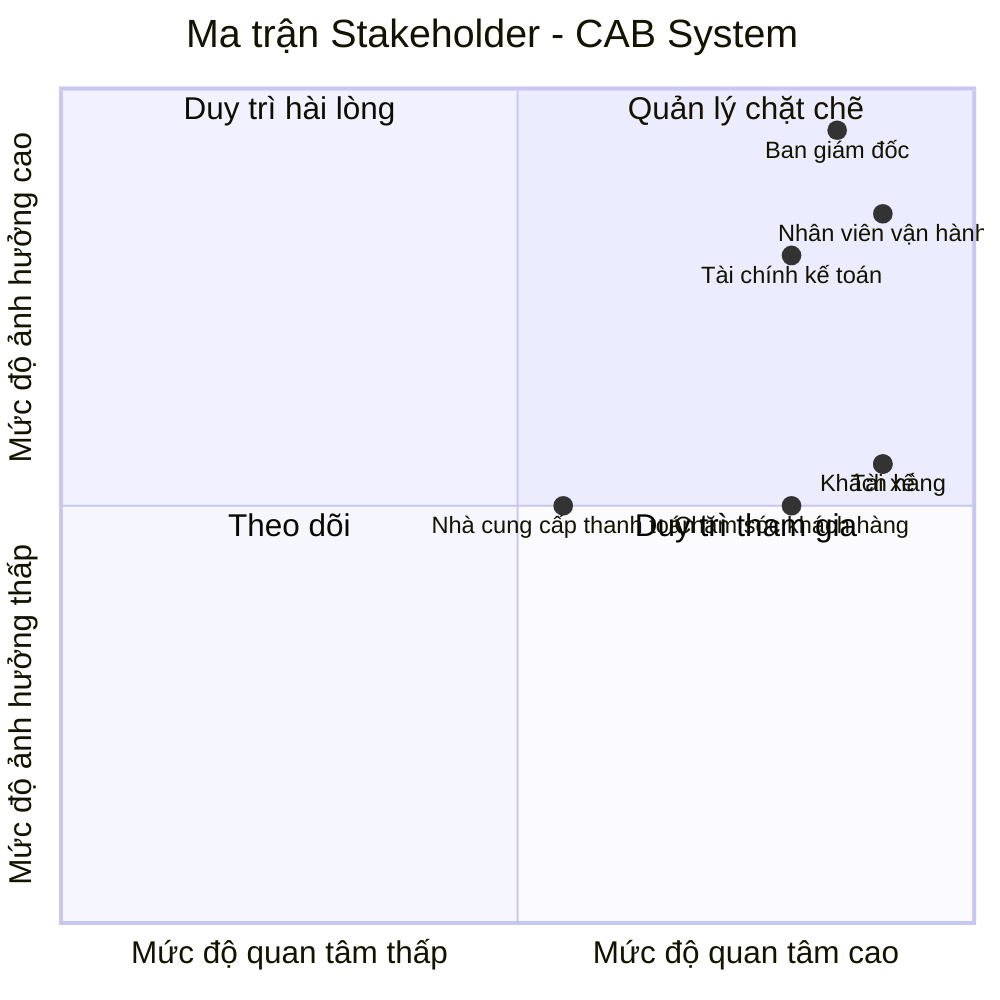

# 23635581_DoanQuocThai_capsystem
hoc thuc hanh buoi 1

1. Các yếu điểm và hạn chế của hệ thống hiện tại

| Nhóm vấn đề            | Hạn chế của hệ thống hiện tại                                      | Hệ quả                                      
|------------------------|--------------------------------------------------------------------|-------------------------
| Phân công tài xế   | Chủ yếu thực hiện thủ công                                         | Tốn thời gian, dễ sai sót                    
| Tìm tài xế        | Chưa tự động tìm và ưu tiên tài xế phù hợp/gần khách               | Thời gian chờ xe lâu                        
| Theo dõi chuyến đi | Khách hàng khó theo dõi trạng thái chuyến                          | Trải nghiệm khách hàng chưa tốt              
| Thông tin tài xế   | Chưa được quản lý tập trung và đồng bộ                             | Khó kiểm soát trạng thái tài xế              
| Vị trí tài xế     | Chưa khai thác tốt dữ liệu vị trí                                  | Khó tìm tài xế gần khách                     
| Thanh toán        | Thông tin thanh toán chưa được quản lý tập trung                   | Khó tra cứu và đối soát giao dịch            
| Tích hợp thanh toán| Chưa có kiến trúc rõ ràng cho payment provider                     | Khó mở rộng phương thức thanh toán           
| Thông báo        | Chưa có hệ thống thông báo đa kênh                                 | Có thể bỏ lỡ thông tin quan trọng             
| Lịch sử chuyến đi | Khả năng quản lý và tra cứu còn hạn chế                            | Khó xử lý khiếu nại và tra cứu chuyến         
| Đánh giá           | Chưa có quy trình đánh giá tài xế hoàn chỉnh                       | Khó thu thập phản hồi                         
| Quản trị          | Vận hành khó quản lý khách hàng, tài xế và chuyến đi               | Tăng công việc thủ công                       
| Báo cáo            | Chưa có dữ liệu/báo cáo tập trung                                  | Khó đưa ra quyết định dựa trên dữ liệu        
| Phân quyền| Chưa đáp ứng tốt nhu cầu phân quyền quản trị                       | Có nguy cơ thao tác vượt quyền                
| Bảo mật         | Chưa bảo vệ đầy đủ dữ liệu cá nhân, vị trí, giao dịch              | Tăng rủi ro bảo mật                                          
| Khả năng mở rộng | Khó đáp ứng khi số lượng khách/tài xế tăng                         | Có nguy cơ giảm hiệu năng                     
| Khả năng phát triển| Kiến trúc chưa linh hoạt cho việc thêm dịch vụ/payment/notification| Thay đổi có thể ảnh hưởng hệ thống hiện tại   
| Xử lý lỗi       | Chưa có cơ chế rõ ràng cho reject, timeout, payment fail, mất mạng | Dễ làm gián đoạn quy trình đặt xe             

## Tại sao cần một hệ thống mới?

Hệ thống hiện tại còn phụ thuộc nhiều vào thao tác thủ công trong việc tìm và phân công tài xế, gây chậm trễ và dễ xảy ra sai sót. Khả năng theo dõi chuyến đi, quản lý thanh toán, thông báo và dữ liệu vận hành còn hạn chế. Ngoài ra, hệ thống chưa đáp ứng tốt yêu cầu về bảo mật, khả năng mở rộng và tích hợp các dịch vụ mới.

Vì vậy, doanh nghiệp cần xây dựng **CAB System mới** nhằm tự động hóa quy trình đặt xe, nâng cao hiệu quả vận hành, cải thiện trải nghiệm khách hàng và tạo nền tảng linh hoạt cho việc mở rộng trong tương lai.

2. Stakeholder chính

| # | Stakeholder | Vai trò | Tầm quan trọng |
|---|---|---|---|
| 1 | **Khách hàng** | Người đặt và sử dụng dịch vụ xe | **Rất cao** – Là người trực tiếp sử dụng hệ thống và ảnh hưởng trực tiếp đến trải nghiệm dịch vụ. |
| 2 | **Tài xế** | Người nhận và thực hiện chuyến xe | **Rất cao** – Trực tiếp cung cấp dịch vụ và tham gia vào toàn bộ quá trình thực hiện chuyến. |
| 3 | **Nhân viên vận hành** | Điều phối, giám sát tài xế và chuyến đi | **Rất cao** – Trực tiếp quản lý hoạt động vận hành và xử lý các trường hợp phát sinh. |
| 4 | **Ban giám đốc / Chủ doanh nghiệp** | Định hướng kinh doanh, quyết định mục tiêu và phạm vi dự án | **Rất cao** – Quyết định mục tiêu, phạm vi, ưu tiên và định hướng phát triển hệ thống. |
| 5 | **Bộ phận tài chính / kế toán** | Quản lý cước, thanh toán, doanh thu và đối soát | **Cao** – Đảm bảo các nghiệp vụ tính cước, thanh toán và quản lý doanh thu được thực hiện chính xác. |
| 6 | **Bộ phận chăm sóc khách hàng** | Hỗ trợ khách hàng, xử lý khiếu nại và sự cố | **Cao** – Trực tiếp hỗ trợ khách hàng và xử lý các vấn đề phát sinh trong quá trình sử dụng dịch vụ. |
| 7 | **Nhà cung cấp dịch vụ thanh toán** | Xử lý các giao dịch thanh toán điện tử cho hệ thống CAB | **Cao** – Đảm bảo giao dịch thanh toán được thực hiện, xác nhận kết quả và hỗ trợ xử lý giao dịch thất bại. |

# Phạm vi cốt lõi trong 7 tuần

| # | Vấn đề cốt lõi | Nội dung cần giải quyết |
|---|---|---|
| 1 | **Quản lý tài khoản và người dùng** | Đăng ký, đăng nhập, cập nhật thông tin; quản lý khách hàng, tài xế, phương tiện và phân quyền nhân viên. |
| 2 | **Đặt xe và tìm tài xế** | Khách hàng tạo yêu cầu đặt xe; hệ thống tìm và ưu tiên tài xế phù hợp dựa trên vị trí, trạng thái và tiêu chí vận hành; xử lý trường hợp tài xế từ chối hoặc không phản hồi. |
| 3 | **Quản lý và theo dõi chuyến đi** | Quản lý toàn bộ trạng thái chuyến từ khi tạo yêu cầu đến khi hoàn thành; cập nhật vị trí tài xế và cung cấp trạng thái/ETA cho khách hàng. |
| 4 | **Tính cước và thanh toán** | Tính số tiền phải trả, hỗ trợ thanh toán tiền mặt và thanh toán điện tử thông qua nhà cung cấp bên ngoài; xử lý giao dịch thất bại. |
| 5 | **Thông báo và tương tác** | Gửi thông báo cho khách hàng và tài xế về các sự kiện quan trọng như tạo chuyến, nhận chuyến, tài xế đến, hoàn thành và thanh toán. |
| 6 | **Quản lý vận hành và hỗ trợ** | Nhân viên vận hành theo dõi chuyến, trạng thái tài xế, tra cứu lịch sử và xử lý các trường hợp bất thường hoặc khiếu nại. |
| 7 | **Lịch sử, đánh giá và báo cáo** | Lưu lịch sử chuyến và giao dịch, cho phép khách hàng đánh giá tài xế và cung cấp các báo cáo vận hành cơ bản. |

# Business Requirements

| ID | Yêu cầu nghiệp vụ | Mô tả |
|---|---|---|
| BR-01 | **Quản lý khách hàng, tài xế và tài khoản** | Doanh nghiệp cần quản lý tập trung thông tin khách hàng, tài xế và phương tiện để phục vụ hoạt động đặt và vận hành dịch vụ. |
| BR-02 | **Đặt xe** | Doanh nghiệp cần cung cấp quy trình đặt xe cho phép khách hàng gửi yêu cầu dựa trên điểm đón, điểm đến và loại xe mong muốn. |
| BR-03 | **Tự động tìm và phân công tài xế** | Doanh nghiệp cần tự động tìm và ưu tiên tài xế phù hợp dựa trên vị trí, trạng thái sẵn sàng và các tiêu chí vận hành đã thống nhất. |
| BR-04 | **Xử lý trường hợp tài xế không nhận chuyến** | Doanh nghiệp cần có cơ chế tiếp tục tìm tài xế khác khi tài xế được đề xuất từ chối hoặc không phản hồi trong thời gian quy định. |
| BR-05 | **Quản lý và theo dõi chuyến đi** | Doanh nghiệp cần quản lý toàn bộ vòng đời của chuyến đi và cho phép các bên liên quan theo dõi trạng thái chuyến. |
| BR-06 | **Theo dõi vị trí và thời gian dự kiến** | Doanh nghiệp cần khai thác thông tin vị trí tài xế để hỗ trợ điều phối, tìm tài xế phù hợp và cung cấp thời gian dự kiến đến cho khách hàng. |
| BR-07 | **Tính cước và thanh toán** | Doanh nghiệp cần xác định số tiền khách hàng phải trả và hỗ trợ thanh toán bằng tiền mặt hoặc phương thức thanh toán điện tử thông qua đối tác thanh toán. |
| BR-08 | **Xử lý giao dịch thanh toán** | Doanh nghiệp cần quản lý kết quả thanh toán và có cơ chế xử lý khi giao dịch thất bại theo chính sách đã thống nhất. |
| BR-09 | **Quản lý thông báo** | Doanh nghiệp cần đảm bảo khách hàng và tài xế nhận được thông tin quan trọng liên quan đến chuyến đi và thanh toán. |
| BR-10 | **Quản lý vận hành** | Doanh nghiệp cần cung cấp khả năng theo dõi khách hàng, tài xế, phương tiện và các chuyến đang diễn ra để hỗ trợ hoạt động vận hành. |
| BR-11 | **Xử lý trường hợp ngoại lệ** | Doanh nghiệp cần có quy trình xử lý các trường hợp như không tìm được tài xế, tài xế từ chối, timeout, thanh toán thất bại hoặc chuyến bị lỗi. |
| BR-12 | **Quản lý lịch sử và giao dịch** | Doanh nghiệp cần lưu trữ và tra cứu lịch sử chuyến đi, thông tin cước và giao dịch để phục vụ khách hàng, vận hành và đối soát. |
| BR-13 | **Đánh giá dịch vụ** | Doanh nghiệp cần thu thập đánh giá của khách hàng sau khi chuyến hoàn thành để theo dõi chất lượng dịch vụ và hiệu quả tài xế. |
| BR-14 | **Quản lý và báo cáo vận hành** | Doanh nghiệp cần có dữ liệu và báo cáo về số lượng chuyến, doanh thu, tỷ lệ hoàn thành, tỷ lệ hủy và hiệu quả hoạt động của tài xế. |
| BR-15 | **Kiểm soát quyền truy cập** | Doanh nghiệp cần kiểm soát quyền truy cập và thao tác của nhân viên theo vai trò để bảo vệ dữ liệu và hạn chế thao tác trái phép. |
